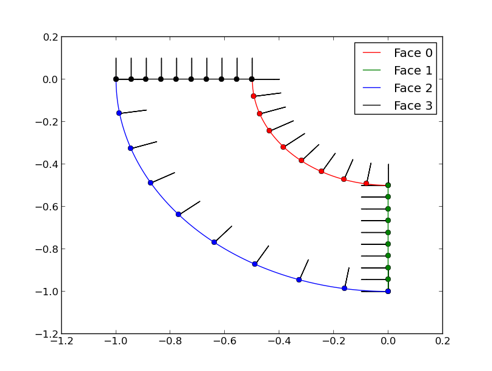
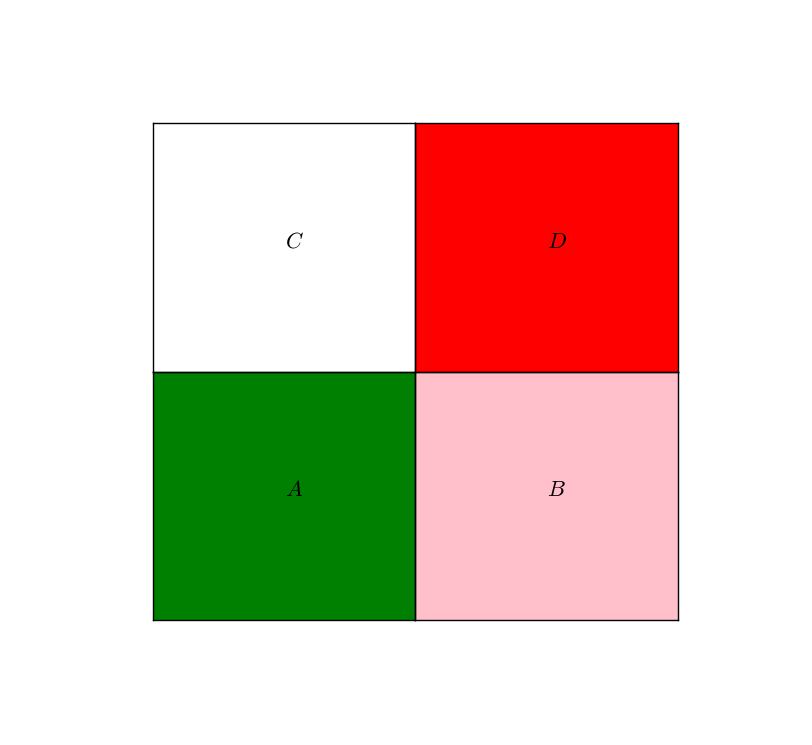
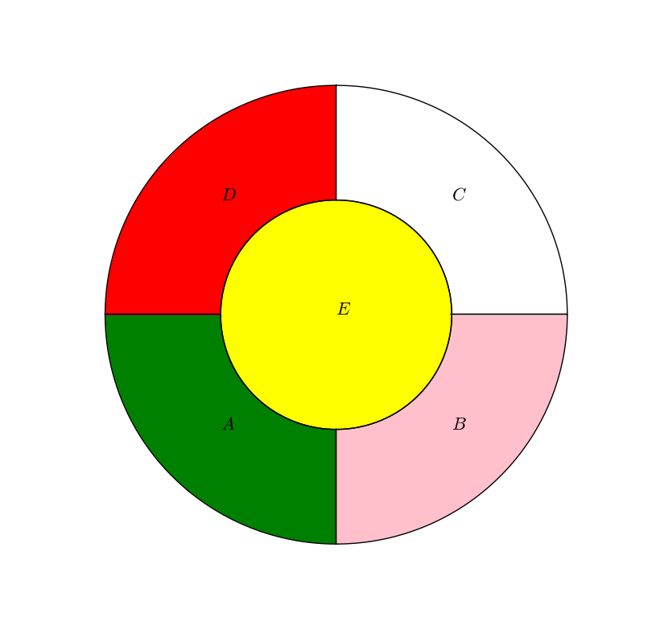
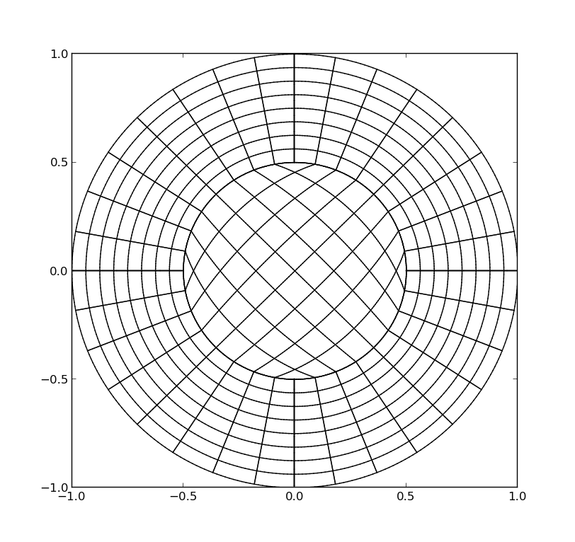
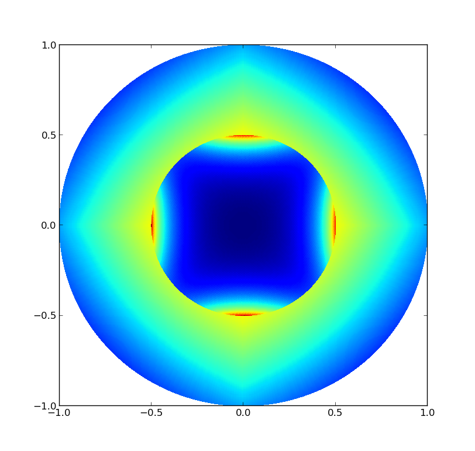

.. role:: envvar(literal)
.. role:: command(literal)
.. role:: file(literal)
.. _cad_geometry:

===================
The geometry module
===================

The geometry module is based on *igakit*. 

igakit
******

igakit: is a toolkit for IsoGeometric Analysis (IGA) maintained by L. Dalcin. You can find it `here <https://bitbucket.org/dalcinl/igakit>`_. Download can be done using::

   hg clone https://bitbucket.org/dalcinl/igakit

igakit is very nice when you need to deal with a single patch, or to apply classical algorithms on B-splines/NURBS curves, surfaces or volumes. In order to have an appropriate geometry description for FEM, I've implemented the *cad-geometry* module, which is based on *igakit*. 

.. note:: For the moment, the current *igakit* version used in *pigasus* was not yet merged with the one maintained by L. Dalcin.

cad-geometry
************

**Pigasus** needs a *cad_geometry* object as an input. This object contains a list of *cad_nurbs* (more generally any class that inherits from the *cad_object* class) with some additional informations. The class *cad_nurbs* inherits the *NURBS* class in *igakit*. It represents a single patch but with some additional informations like

* orientation: needed for *Neumann* boundary conditions

* rational: *True* if we use the weights. Default value : *False*

In order to create a geometry, one can import directly some predefined ones as the following::

  from igakit.cad_geometry import annulus as domain
  geo = domain()  
  
You can then export the geometry into an **XML** format::

  geo.save("annulus.xml")

**zip** and **txt** formats are also possible. In the f
  
Now, let's look at the generated file:

.. literalinclude:: include/introduction/annulus.xml 
    :linenos:
    :language: xml

In fact, each time you use a predefined geometry, it will provide you with the corresponding connectivity. However, if you
construct your own geometry (e.g. by sticking two patchs together) you need to update these informations. Next, we show the **merge** method and how it can be used to merge two geometries.

.. note:: In the previous xml file, we can see that each connectivity element contains an original *face* and a clone *face*. We also have lists of *internal faces* and *external faces*. The latter is very important for boundary conditions.

You can also specify the grid size and the polynomial degree::

  from igakit.cad_geometry import annulus as domain
  geo = domain(n=[16,16], p=[2,2])

In order to set boundary conditions, you need to know the correspondance between the unit square faces and the physical domain. This can be done using the function *plotBoundariesInfo* as the following::

    import matplotlib.pyplot as plt
    from igakit.cad_geometry import quart_circle as domain
    geo = domain()
    nrb = geo[0]
    nrb.plotBoundariesInfo()
    plt.show()

which gives the following plot

as we can see, it also plots the orientation of the normal vectors. If you create your own geometry, you have to set the corresponding *signs* in order to get the good orientation.

Using Multi-Patch
^^^^^^^^^^^^^^^^^

In many applications, we need to use a multi-patch description. This means that the physical domain will be splitted into sub-domains, each of them is an image of a square in *2D* (line in *1D*, cube in *3D*). Therefore, we need to provide the connectivity of these macro-elements. For this purpose, we have added the *merge* function that does this (almost) automatically. Next we give two examples of constructing a *4* patchs description of the square and a *5* patchs description of the circle.

.. code-block:: python 

    # ... Import the square domain -A-
    geo_1 = square(n=[nx,ny],p=[px,py])

    # ... Import the square domain -B-
    geo_2 = square(n=[nx,ny],p=[px,py])
    geo_2[0].translate(1.0, axis=0)

    # ... Import the square domain -C-
    geo_3 = square(n=[nx,ny],p=[px,py])
    geo_3[0].translate(1.0, axis=1)

    # ... Import the square domain -D-
    geo_4 = square(n=[nx,ny],p=[px,py])
    geo_4[0].translate(1.0, axis=0)
    geo_4[0].translate(1.0, axis=1)

    # ... merging geometries
    geo_12 = geo_1.merge(geo_2)
    geo_34 = geo_3.merge(geo_4)
    geo = geo_12.merge(geo_34)

    # ... scaling to the unit square
    for i in range(0, geo.npatchs):
        geo[i].scale(0.5, axis=0)
        geo[i].scale(0.5, axis=1)

which gives the following subdivision

An interesting example is the construction of a circle domain using *5* patchs, which can be done as the following

.. code-block:: python 

    # ... Import the quart_circle domain -A-
    geo_1 = quart_circle(n=[nx,ny],p=[px,py])
    geo_1[0].transpose()

    # ... Import the quart_circle domain -B-
    geo_2 = quart_circle(n=[nx,ny],p=[px,py])
    geo_2[0].rotate(0.5*np.pi)
    geo_2[0].transpose()

    # ... Import the quart_circle domain -C- 
    geo_3 = quart_circle(n=[nx,ny],p=[px,py])
    geo_3[0].rotate(np.pi)
    geo_3[0].reverse(0)

    # ... Import the quart_circle domain -D-
    geo_4 = quart_circle(n=[nx,ny],p=[px,py])
    geo_4[0].rotate(1.5*np.pi)
    geo_4[0].reverse(0)

    # ... Import the circle domain -E-
    geo_5 = circle(radius=0.5,n=[nx,ny],p=[px,py])
    geo_5[0].rotate(0.25*np.pi)
    geo_5[0].rotate(0.5*np.pi)

    # ... merging geometries
    geo_12   = geo_1.merge(geo_2)
    geo_34   = geo_3.merge(geo_4)
    geo_1234 = geo_12.merge(geo_34)
    geo      = geo_1234.merge(geo_5)

which gives the following subdivision

.. note:: Sometimes you need to reverse the parametrization of the domain in order to merge it with another one. In the previous example, we see that we had to reverse the parametrization for the quart circles **C** and **D**. Otherwise, **pigasus** will not reconize the duplicated faces. In this case, you will get a message informing you that **pigasus** found 2 faces that can match if you reverse the parametrization of one of them.

The resulting mesh for the previous geometry is 

We can check the **Jacobian** of the corresponding mappings by typing

.. code-block:: python

   import matplotlib.pyplot as plt
   geo.plotJacobians(MeshResolution=50)
   plt.show()

which gives the following plot

About the **XML** format
^^^^^^^^^^^^^^^^^^^^^^^^

Many formats exist to describe B-splines and NURBS. We prefered to developp our own format so that we can include some additional data needed for the Finite Element solver.

In some cases, the user may want to add specific informations about one single *B-spline/NURBS* (patch). This can be achieved using *XML* attributs. For instance, any *cad_object* object offers the *set_attribut* function. Here are some examples:

.. code-block:: python

   C = [[0, 1], [1, 1], [1, 0]] # 3x2 grid of 2D control points
   w = [1, np.sqrt(2)/2, 1]     # rational weigths
   U = [0,0,0, 1,1,1]           # knot vector
   crv = cad_nurbs([U], C, weights=w)   
   crv.set_attribut("name", "arc-circle")
   crv.set_attribut("color", "#7A3030")
   crv.set_attribut("type", "nurbs")

For the moment only three attributs exist:

* **name** : sets a name for the patch,

* **color** : sets a color for the patch,

* **type** : the type of the patch. Possible values are **spline**, **nurbs** and **gradiant**. When not specified, this means that the patch is either a *spline* or a *nurbs*.

.. Local Variables:
.. mode: rst
.. End:
