.. role:: envvar(literal)
.. role:: command(literal)
.. role:: file(literal)
.. _multigrid:

Geometric MultiGrid
===================

References 

Anisotropic diffusion : :cite:`Perona90`, :cite:`Gunter2005`, :cite:`Gunter2007`, :cite:`Gunter2009`, :cite:`Meier2010`, :cite:`sharma_hammett_2011`

Mesh Adaptation : :cite:`Li2010`

Anisotropic FEM : :cite:`daVeiga2012b`

B-splines :cite:`Kadalbajoo2008a`, :cite:`Kadalbajoo2008b`

We consider the elliptic problem:

.. math::
   :label: anidiff_eq

   - \nabla \cdot (A_{\epsilon} \nabla u_{\epsilon}) = f

with Dirichlet boundary conditions. The matrix :math:`A_{\epsilon}` is of the form:

.. math::

   A_{\epsilon} = \epsilon \mathbb{I} + (1-\epsilon) \mathbf{b} \otimes \mathbf{b}

where :math:`\mathbf{b} = \frac{\mathbf{B}}{\| \mathbf{B} \|}` and :math:`\epsilon << 1` is the characteristic parameter for the anisotrpy problem.

In the following tests, we consider :math:`\mathbf{b}=(\cos(\phi), \sin(\phi))`, :math:`\phi=\frac{2 \pi}{3}` and :math:`\epsilon = 10^{-3}, 10^{-6}, 10^{-9}`. The physical
domain is either a unit square or an X-point-like domain, as shown in fig  :ref:`xpoint_domain`.

.. \label{xpoint_domain}

Interpolation and reduction operators
^^^^^^^^^^^^^^^^^^^^^^^^^^^^^^^^^^^^^

Our operators are based on the knot insertion algorithm. First, we recall the algorithm in the :math:`1D` case.

Knot insertion
______________

One can insert a new knot :math:`t`, where :math:`t_j \leqslant t < t_{j+1}`. For this purpose we use the DeBoor algorithm :cite:`DeBoor_Book2001`:

:math:`\widetilde{N} = N+1:math:`

:math:`\widetilde{k} = k:math:`

:math:`\widetilde{T} = \{ t_1,.., t_j, t, t_{j+1},.., t_{N+k}\}`

:math:`\alpha_i = \left\{\begin{array}{cc}1 & 1 \leqslant i \leqslant j-k+1 \\\frac{t-t_i}{t_{i+k-1}-t_i} & j-k+2 \leqslant i \leqslant j \\0 & j+1 \leqslant i \end{array}\right.`

:math:`\textbf{Q}_i = \alpha_i \textbf{P}_i + (1-\alpha_i) \textbf{P}_{i-1}`   

This can be written in the matrix form as 

:math:`\textbf{Q} = A \textbf{P}`

The basis transformation :math:`A` is called \textit{the knot insertion matrix} of degree :math:`k-1` from :math:`T` to :math:`\widetilde{T}`.

Now let us consider a nested sequence of knot vectors :math:`T_0 ~ \subset ~ T_1 ~ \subset ~\dots ~ \subset ~T_n`, where :math:`\#(T_{i+1} - T_i)= 1`. The knot
insertion matrix from :math:`T_i` to :math:`T_{i+1}` is denoted by :math:`A_i^{i+1}`. It is easy to see that the insertion matrix from :math:`T_0` to

:math:`T_{n}` is simply:

:math:`A := A_0^{n} = A_0^{1} ~A_1^{2} ~ \dots ~ A_{n-1}^{n}`

In the case of :math:`2D`, the interpolation operator can be constructed using the Kronecker product, as follows

:math:`A_{\eta} \otimes A_{\xi}`

.. note::
	The latter construction is somehow bad for complex geometries. Another approach is to add weights depending on the volume
	associated to control points. This explains the relative bad behavior of our multigrid in the case of X-point domain
	compared to the square domain.

Using Pigasus
_____________

We show in this section how to use the Geometric Multigrid in **pigasus**. 

The following script describes 

.. code-block:: python

   # ... constructs a hierarchy of geometries
   from pigasus.utils.utils import hierarchical_geometries
   geo = domain(n=[nx,ny],p=[px,py])
   list_geometry = hierarchical_geometries(geo, nlevel, domain)
   # ...

   # ... the finest geometry is geo_h
   geo_h = list_geometry[-1]
   # ...

   # ... define the problem we want to solve. This can be any operator defined using the basicPDE class
   PDE = poisson(geometry=geo_h, bc_dirichlet=bc_dirichlet, bc_neumann=bc_neumann \
                 , AllDirichlet=AllDirichlet, Dirichlet=Dirichlet,metric=Metric)
   # ...

   # ... creates the corresponding multigrid solver
   MG = multigrid(PDE, list_geometry=list_geometry)
   # ...

   # ... aasemble the PDE
   PDE.assembly()
   # ...

   # ... solve using the multigrid as standalone 
   rhs = PDE.rhs
   mg_residuals = MG.solve(rhs, verbose=True, accel=None)
   # ...

   # ... solve using the multigrid as preconditionner 
   rhs = PDE.rhs
   mg_residuals = MG.solve(rhs, verbose=True, accel='gmres')
   # ...

See :download:`the complete script <include/demo/test_multigrid.py>`.

Numerical results
^^^^^^^^^^^^^^^^^

In figures :ref:`square_accelconvergence` and :ref:`xpoint_accelconvergence`, we plot the history of residuals until convergence for the geometric multigrid and the accelerated *gmres* preconditioned with our geometric multigrid.

Square domain: Convergence of the Multigrid and accelerated GMRES for :math:`\epsilon = 10^{-3}, 10^{-6}, 10^{-9}` on a
128x128 grid.

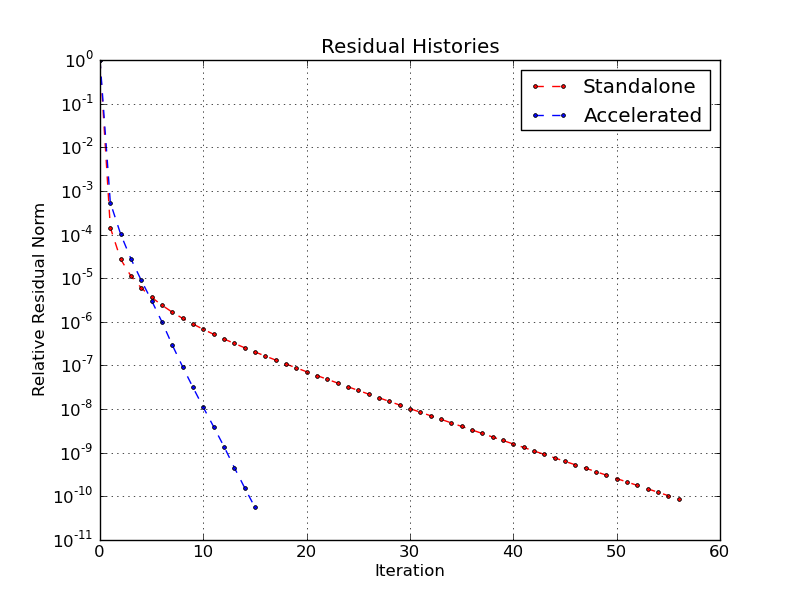

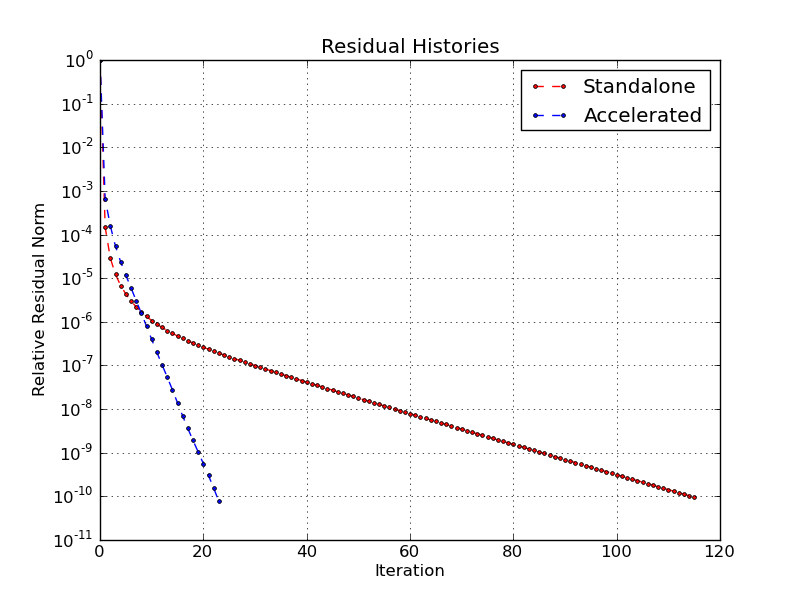

.. \label{square_accelconvergence}

X-point domain: Convergence of the Multigrid  and accelerated GMRES for :math:`\epsilon = 10^{-3}, 10^{-6}, 10^{-9}` on a 128x128 grid.

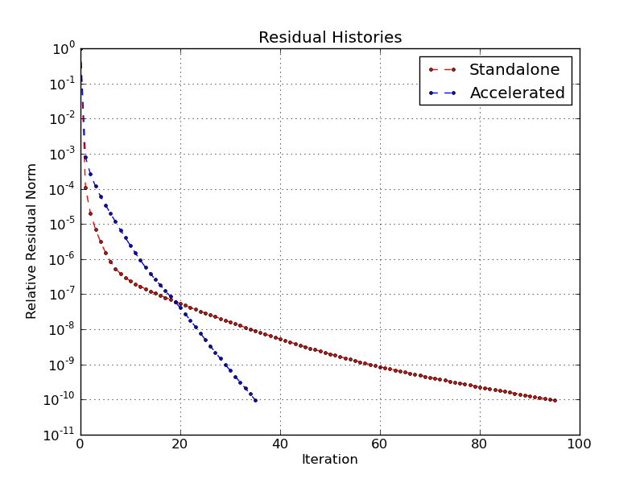

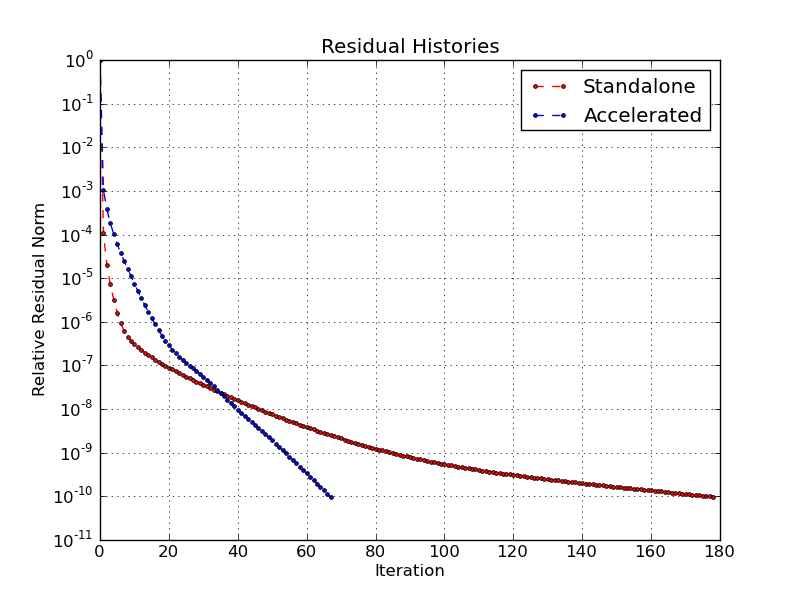

.. \label{xpoint_accelconvergence}

The current tests were done using a parallel version of *Petsc* preconditioned with algebraic multigrid (AMG) and the implemented sequential version in *pigasus*.
In figures :ref:`square_elapsed` and :ref:`xpoint_elapsed`, we plot the elapsed time before convergence.

Square domain: elapsed time for :math:`\epsilon = 10^{-3}, 10^{-6}, 10^{-9}`}

.. image:: include/multigrid/square_elapsed_eps1e_3.png
   :width: 8cm
   :height: 8cm

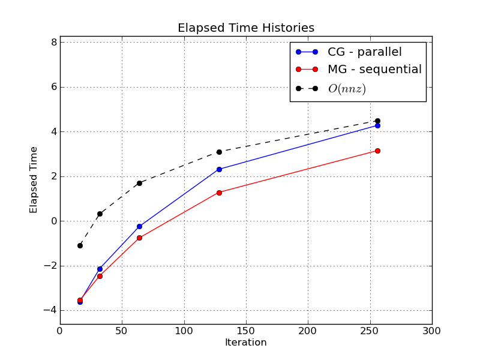

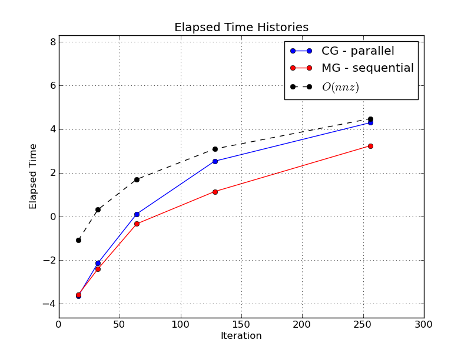

.. \label{square_elapsed}

X-point domain: elapsed time for :math:`\epsilon = 10^{-3}, 10^{-6}, 10^{-9}`

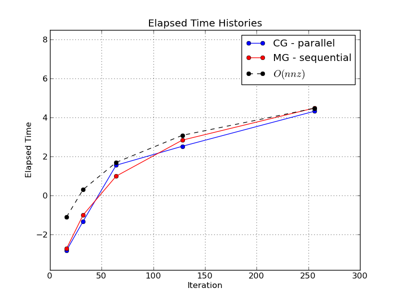

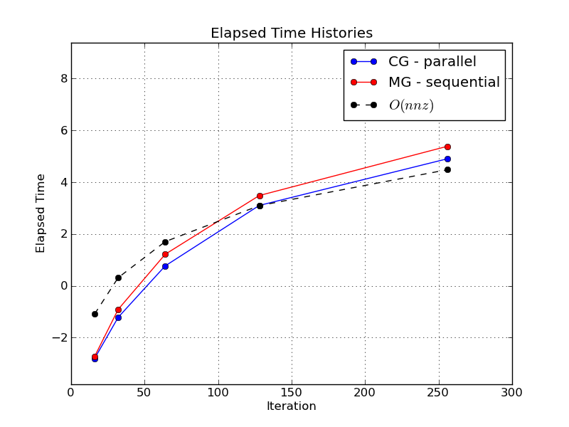

.. \label{xpoint_elapsed}

In figures :ref:`square_convergence` and :ref:`xpoint_convergence`, we plot the history of residuals until convergence.

Square domain: Convergence of the Multigrid for :math:`\epsilon = 10^{-3}, 10^{-6}, 10^{-9}`

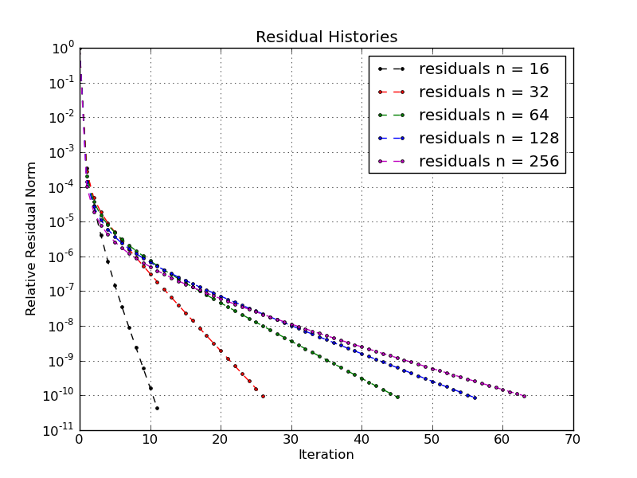

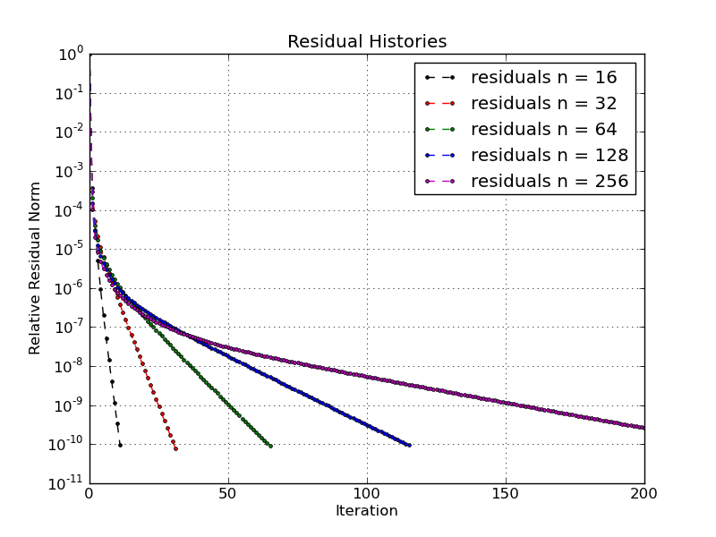

.. \label{square_convergence}

X-point domain: Convergence of the Multigrid for :math:`\epsilon = 10^{-3}, 10^{-6}, 10^{-9}`

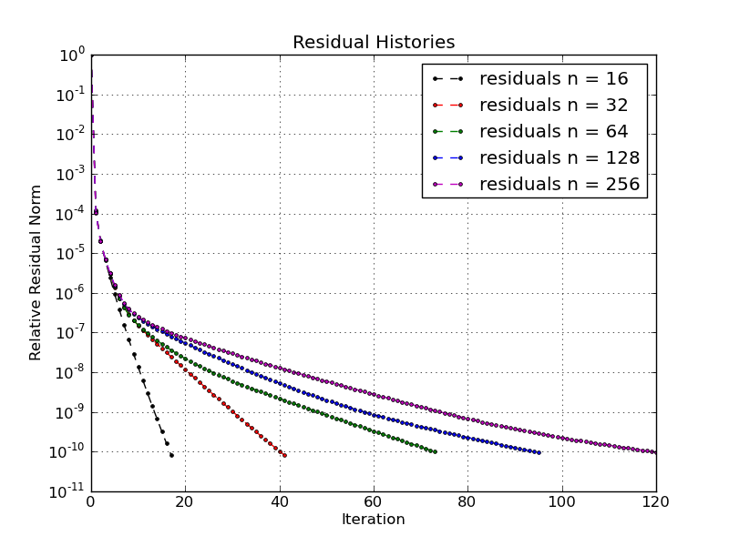

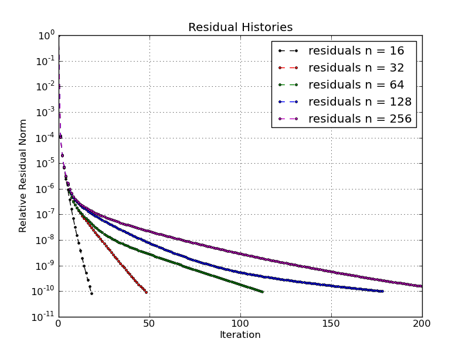

.. \label{xpoint_convergence}

.. \begin{table}
.. 	\centering
.. 	\begin{tabular}{|l| l| l| l| l| l| l|}
.. 		\hline
..   & \multicolumn{2}{|c|}{:math:`\epsilon=10^{-3}`}   & \multicolumn{2}{|c|}{:math:`\epsilon=10^{-6}`}   &  \multicolumn{2}{|c|}{:math:`\epsilon=10^{-9}`}
.. 		\\\hline
.. n &		\textbf{Petsc} & \pigasus  &		\textbf{Petsc} & \pigasus  &		\textbf{Petsc} & \pigasus 
.. 		\\\hline
.. 16 &		23 & 5			   & 23 & 5 		   & 23 & 5 \\
.. 32 &		40 & 10			   & 43 & 10  		   & 43 & 10  \\
.. 64 &		64 & 14			   & 74 & 17   		   & 74 & 17 \\
.. 128 &	       100 & 16			   & 133 & 24   	   & 133 & 24  \\
.. 256 &	       151 & 18			   & 245 & 37  		   & 245 & 37  
.. 		\\\hline
.. 	\end{tabular}
.. 	\caption{square domain: Number of iterations before convergence.}
.. %	\label{tab:<+label+>}
.. \end{table}
.. 
.. \begin{table}
.. 	\centering
.. 	\begin{tabular}{|l| l| l| l| l| l| l|}
.. 		\hline
..   & \multicolumn{2}{|c|}{:math:`\epsilon=10^{-3}`}   & \multicolumn{2}{|c|}{:math:`\epsilon=10^{-6}`}   &  \multicolumn{2}{|c|}{:math:`\epsilon=10^{-9}`}
.. 		\\\hline
.. n &		\textbf{Petsc} & \pigasus  &		\textbf{Petsc} & \pigasus  &		\textbf{Petsc} & \pigasus 
.. 		\\\hline
.. 16 &		37 & 9 			   & 37 & 9 		   & 37 & 9 \\
.. 32 &		48 & 16			   & 48 & 18  		   & 53 & 18 \\
.. 64 &		65 & 27			   & 83 & 37  		   & 83 & 37 \\
.. 128 &		83 & 36			   & 143 & 68  		   & 143 & 68 \\
.. 256 &		118 & 45		   & 248 & 116 		   & 250 & 116  
.. 		\\\hline
.. 	\end{tabular}
.. 	\caption{X-point domain: Number of iterations before convergence.}
.. %	\label{tab:<+label+>}
.. \end{table}

.. Local Variables:
.. mode: rst
.. End:
